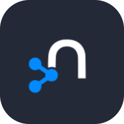
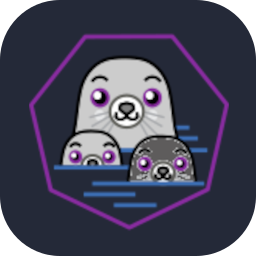

<h1 align="center"> Hello, World!👋 I'm Tommaso. </h1>
<h2 align="center">About me</h2>

  🎓 BSc in Computer Engineering at [University of Pisa](https://www.unipi.it/)
  
  🎓 MSc in Computer Engineering at [University of Pisa](https://www.unipi.it/)
   
  🔭 Interested in Automation, System Optimization, Cyber Security and 3D Printing.

  ♟️ One More Turn. Passionate gamer of strategic and management games. Always exploring new worlds, where I sometimes stumble upon a strange old man who warns: "It's dangerous to go alone! Take this!".

  🛠️ Hands-on with DIY, constantly crafting and building creative solutions.

<h2 align="center">Skills</h2>

<h3 align="center">Programming</h3>

  
  

<!---
erlang
--->

<h3 align="center">Web Development</h3>

  

<h3 align="center">Databases</h3>

  
  

<!---
Neo4j
--->

<h3 align="center">Tools & Platforms</h3>

  
  
  
  
  
  
  

<!---
podman,proxmox
Pytorch Tensorflow Pandas Scikit learn
--->

<h2 align="center">Stats</h2>

<!---

--->
